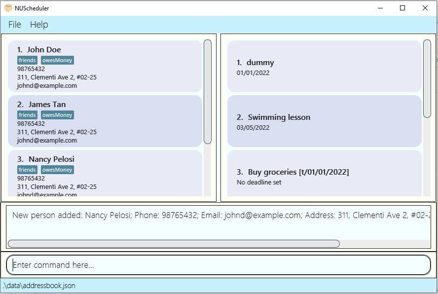

# NUScheduler
***
NUScheduler is a desktop app for Year 1 Computing students to assist with more efficient management of tasks and contacts,
optimized for use via a Command Line Interface (CLI) while still having the benefits of a Graphical User Interface (GUI).
If you can type fast, NUScheduler can schedule your tasks faster than traditional GUI apps. 

## Uses:
***
  * keep track of all school contacts, modules and tasks
  * organise academic life in a neat manner

## Features:
***
  * Add a task/contact
  * Delete a task/contact
  * Update a task/contact
  * Add a label to task
  * View all tasks and their deadlines
  * View all contacts
  * Remind upcoming tasks

## Acknowledgements
***
This project is based on the AddressBook-Level3 project created by the [SE-EDU initiative.](https://se-education.org)
* Libraries used: [JavaFX](https://openjfx.io/), [Jackson](https://github.com/FasterXML/jackson), [JUnit5](https://github.com/junit-team/junit5)

